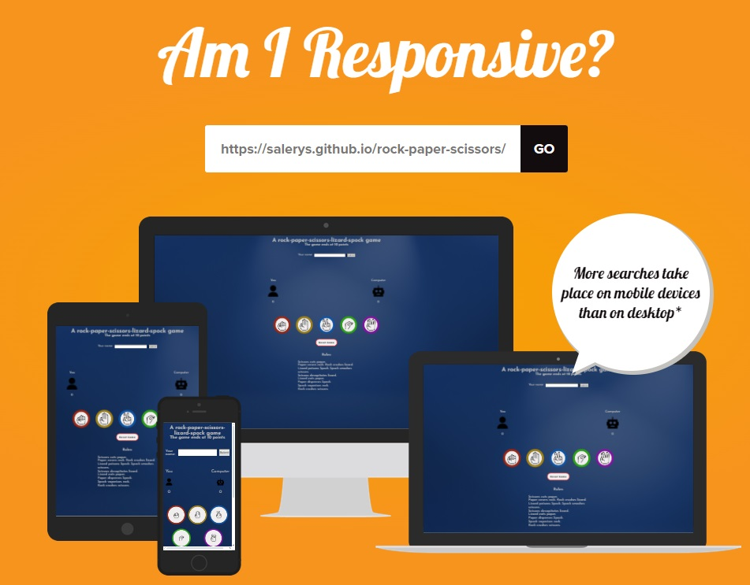
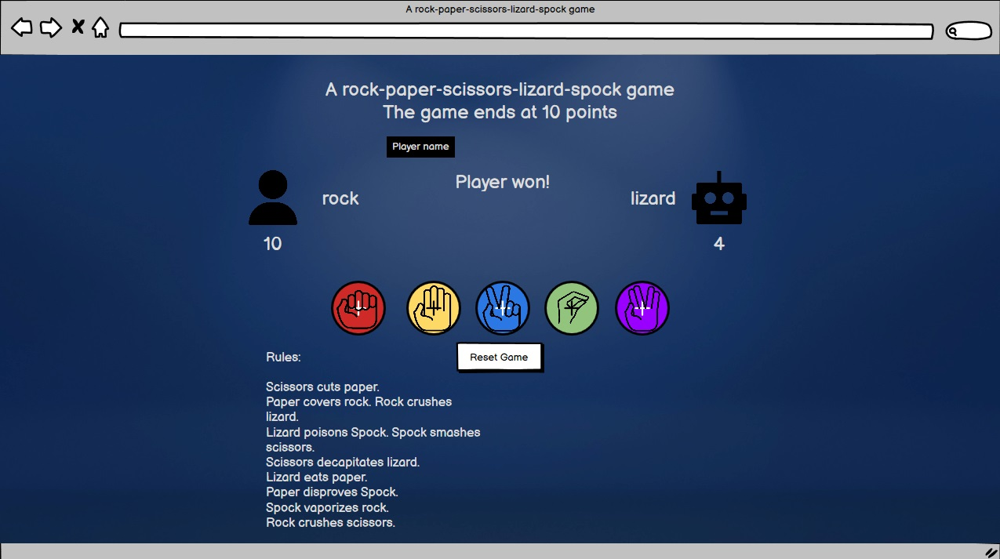
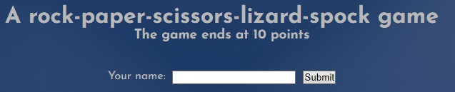
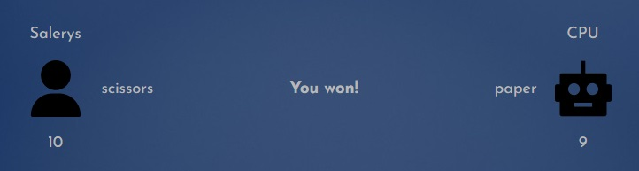
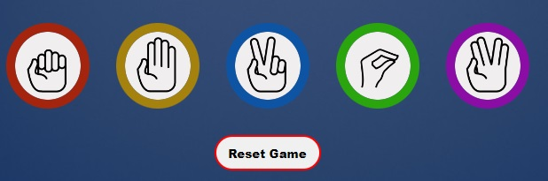
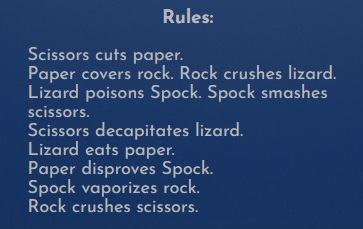
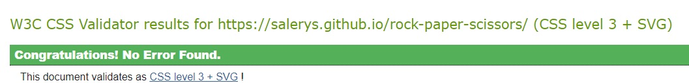
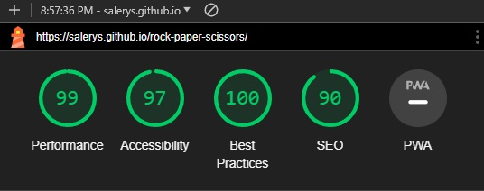

# Rock-Paper-Scissors-Lizard-Spock - just like in The Big Bang Theory!

This minigame was made by Salerys, for the second portfolio project at Code Institute.
The game is played against the computer, and a round goes until someone reaches 10 points.
Can you beat the opponent?

The live link can be found here - [Rock-Paper-Scissors-Lizard-Spock](https://salerys.github.io/rock-paper-scissors/)

## Site Goals
The goal of the site is to let people pass time with something light-hearted and fun, whether they are at home, on public transport, on a break during work, etc. RPSLS is a perfect game for this.

### My Goals as the Site Owner
To give people easy access to something easy, fast and fun for when they need.

### As an User, I want
To be able to have a quick play either against "the computer", or friends without having to prepare tedious tasks, create something on my own, or bring physical games with me in my everyday life. 

## Design

### Imagery
Since this is a game most people know, and even those who don't know can get quickly into it with the rules, I have decided to use a clean, not overcomplicated design.

### Colours

The colour scheme of the website is blue, so it's easy on the eye and doesn't take away the attention of the player. The buttons are simplistic, as the focus of the site is the game itself.

### Fonts

The Josefin-sans font family was used throughout the whole website. I stumbled upon this font while searching for something a bit more soft and fitting to the mental image I had.
The Josefin-sans font can be found at Google-fonts for free.

## Wireframes

Wireframes were produced using Balsamiq.

 
Desktop Wireframe

 

 

    
Mobile Wireframe

 

 ## Features

The site contains all necessary features of a simple, functioning RPSLS game.

### Existing Features

- **A player name input field right under the Heading**
    - The first thing the user sees
    - Gives information to the user about the goal of the website
    - Allows the user to enter their desired name

    

- **Scoreboard**
    - Located below the name input field
    - Shows the user the moves they used, as well as the opponent's chosen move
    - Shows the current score under the user/cpu icon
    - Announces the winner upon either side reaching 10 wins

    

**Game buttons**
- The five moves available in RPSLS
- Allows the user to freely choose their next move
- The reset game button allows the user to start anew anytime

    

**Rules**
- The official rules to RPSLS

    

### Planned future features
- Online multiplayer, allowing the user to play against other people
- Adding background animation
- Better button icons
- Background music with toggle option
- Other "gamemode goals", since currently the only one is "win 10 times"

## Validator Testing

- ### HTML
    - No errors were returned when passing through the official W3C Markup Validator
    - [W3C Validator Results](https://validator.w3.org/nu/?doc=https%3A%2F%2Fsalerys.github.io%2Frock-paper-scissors%2F)

- ### CSS
    - No errors found with the official W3C CSS Validator
    - [W3C CSS Validator Results](https://jigsaw.w3.org/css-validator/validator?uri=https%3A%2F%2Fsalerys.github.io%2Frock-paper-scissors%2F&profile=css3svg&usermedium=all&warning=1&vextwarning=&lang=en)
    - 

- ### JavaScript
    - No errors shown on [JSHint website](https://jshint.com)

- ### Accessibility
    - The site achieved a Lighthouse score of 99%
    - 

- ### Feature Testing
     The name input field has been tested that it shows the input name correctly, as well the five move choices, victory upon 10 win, and the reset option.

- ### Browser Testing
     The site has been tested on IE, Chrome, Firefox and Opera GX browsers without major issues.

- ### Device Testing
    The website was viewed on multiple devices to ensure responsiveness on various screen sizes. Everything performed as intended.
    Responsiveness was also checked using Opera GX developer tools across multiple devices for the various sizes.

    I also used the following websites to test responsiveness:
    - [Responsinator](http://www.responsinator.com/?url=https%3A%2F%2Fsalerys.github.io%2Frock-paper-scissors%2F)
    - [Am I Responsive](https://ui.dev/amiresponsive?url=https://salerys.github.io/rock-paper-scissors/)
    - [AmIResponsive](https://amiresponsive.co.uk)

## Friends and Family User Testing

Friends and family members were asked to review the site to point out any bugs and/or user experience issues.

## Known Bugs
- Creating the repository in the beginning, I named the css folder 'CSS' with all capitals. I then corrected this issue, and from that point on it was shown with lowercase 'css' in VSCode. On the live server the site showed properly, however after publishing on GitHub Pages, the site broke, the css file was not being used.
After asking on Code Institute Slack, someone pointed out that on GitHub my folder is still named 'CSS' even though locally for me it was 'css' for a long time.

- Tried renaming the folder, then creating a brand new one, no matter what I did, I couldn't rename it on GitHub, it stayed 'CSS' even after changing things and pushing.

- Therefore, having no better option, I renamed the file path to the css file in my html to 'CSS', using uppercase letters, which then solved the issue.
While this isn't how it's normally done, and the folder name should be lowercase, this is something noone involved in the discussion could solve.

## Technologies Used
- ### Languages
- HTML5
- CSS
- JavaScript

## Frameworks - Libraries - Programs Used

- [Am I Responsive](http://ami.responsivedesign.is/) - Used to verify responsiveness of website on different devices.
- [Responsinator](http://www.responsinator.com/) - Used to verify responsiveness of website on different devices.
- [AmIResponsive](https://amiresponsive.co.uk) - Used to verify responsiveness of website on different devices.
- [Balsamiq](https://balsamiq.com/) - Used to generate Wireframe images.
- [Chrome Dev Tools](https://developer.chrome.com/docs/devtools/) - Used for overall development and tweaking, including testing responsiveness and performance.
- [Opera GX Dev Tools](https://dev.opera.com/extensions/testing/) - Used for overall development and tweaking, including testing responsiveness and performance.
- [Google Fonts](https://fonts.google.com) - Used for Social Media icons in footer.
- [GitHub](https://github.com/) - Used for version control and hosting.
- [W3C](https://www.w3.org/) - Used for HTML & CSS validation.
- [JSHint](https://jshint.com) - Used for JavaScript validation
- [Flaticon](https://www.flaticon.com) - Used for favicon.
- [The Noun Project](https://thenounproject.com) - Used to get the button icons for the game
- [Freepik](https://www.freepik.com) - Used to get the background image for the website

## Deployment

The project was deployed using GitHub pages. The steps to deploy using GitHub pages are:

1. Go to the repository on GitHub.com
2. Select 'Settings' near the top of the page.
3. Select 'Pages' from the menu bar on the left of the page.
4. Under 'Source' select the 'Branch' dropdown menu and select the main branch.
5. Once selected, click the 'Save'.
6. Deployment should be confirmed by a message on a green background saying "Your site is published at" followed by the web address.

The live link can be found here - [Rock-Paper-Scissors-Lizard-Spock](https://salerys.github.io/rock-paper-scissors/)

## Media
- [Freepik](https://www.freepik.com)
  - benzoix - [Abstract Luxury gradient Blue background. Smooth Dark blue with Black vignette Studio Banner](https://www.freepik.com/free-photo/abstract-luxury-gradient-blue-background-smooth-dark-blue-with-black-vignette-studio-banner_16971855.htm#fromView=search&page=3&position=40&uuid=77ad8a91-e2cb-46d3-8520-4d082a9eedb3)
- [Google fonts](https://fonts.google.com)
  - [Josefin-sans font](https://fonts.google.com/share?selection.family=Josefin+Sans:ital,wght@0,100..700;1,100..700)
- [Flaticon](https://www.flaticon.com)  
    - Freepik - [Rock Paper Scissors free icon](https://www.flaticon.com/free-icon/rock-paper-scissors_6851302?term=rock+paper+scissors&page=1&position=31&origin=tag&related_id=6851302)
    - Vector Bazar - [User free icon](https://www.flaticon.com/free-icon/user_15568014?term=human&page=1&position=74&origin=search&related_id=15568014)
    - Kiranshastry - [Robot free icon](https://www.flaticon.com/free-icon/robot_711923?term=robot&page=1&position=18&origin=search&related_id=711923)
- [The Noun Project](https://thenounproject.com)
    - Till Teenck - [Lizard Hand](https://thenounproject.com/icon/lizard-hand-389091/)
    - Studio Fibonacci - [spock](https://thenounproject.com/icon/spock-88664/)
    - Studio Fibonacci - [rock](https://thenounproject.com/icon/rock-88661/)
    - Studio Fibonacci - [Scissors](https://thenounproject.com/icon/scissors-88666/)
    - Studio Fibonacci - [Paper](https://thenounproject.com/icon/paper-88662/)

## Resources Used
 - Inspiration for the README file from [Kay-ddggxh](https://github.com/Kay-ddggxh), [and their ppt2 readme](https://github.com/Kay-ddggxh/CI-PP2_memory-card-game) (thank you Kay for sharing it with me)

## Acknowledgements
- The Code Institute slack community for their quick responses and very helpful feedback
- My real life friends Thomas and Matthew who answered all my questions whenever I got stuck in JavaScript, and gave feedback on my coding, without them I would still be searching for answers on Google